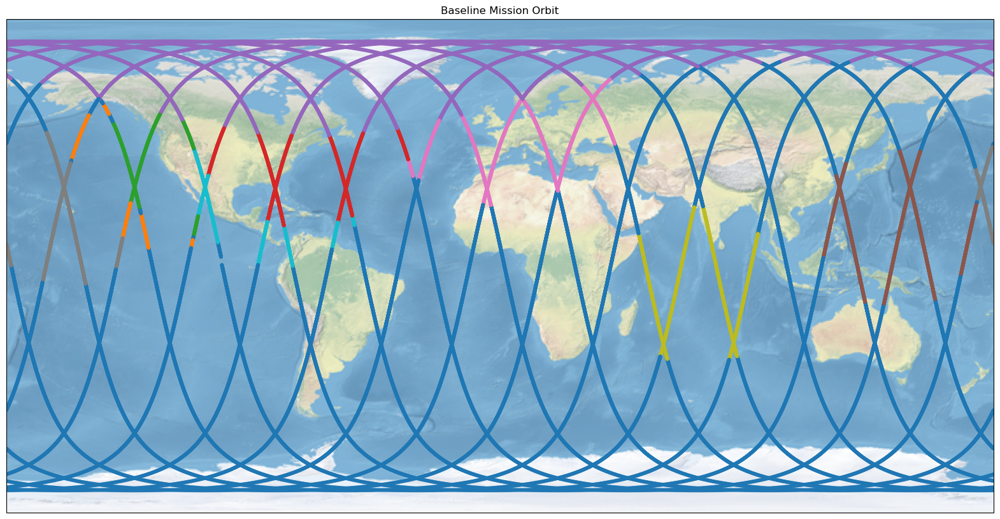

# SCAD: Space Cyber Anomaly Detection Dataset

The **SCAD Dataset** (Space Cyber Anomaly Detection Dataset) provides high-fidelity 
satellite telemetry under both normal operating conditions and simulated cyber 
intrusion scenarios. It is designed as a public dataset for developing and 
evaluating AI/ML-based intrusion detection systems for space missions.

---

## Overview

- **Domain:** Satellite operations and cybersecurity
- **Content:** Time-series telemetry from a FireSat satellite digital twin
- **Scenarios:** 
  - Baseline (120 variations of normal operations)
  - Long Baseline (24 hours of normal mission operations)
  - Multiple labeled cyber anomaly cases (1800 cyber scenarios)
- **Purpose:** 
  - Benchmark for anomaly detection and classification
  - Resource for AI/ML, space operations, and cybersecurity researchers

---
## Baseline Mission Description ## 

The FireSat satellite mission is to orbit the earth scanning for wildfires and when in Line-of-Sight with certain ground stations, point to them for downlink communications.  Other times in the mission, the satellite is sustaining itself by being in a solar point mode.  

---
## Cyber Attack Scenario Description ##

The cyber attack modeled in this dataset is assuming the satellite is compromised, perhaps from a supply chain attack or from an exploited vulnerability, but the modelled effects focus on the damaging effects that a cyber attacker could perform.  The satellite operates with three reaction wheels, one for each axis of rotation.  THe cyber attack overrides the commanding of those reaction wheels forcing the FireSat to spin along an axis.  The other reaction wheels and components attempt to compensate for the override through normal operation.  

---

## Dataset Structure
### The Data Files ###
The dataset contains baseline scenario mission data as well as cyber attack scenario data.  Scenarios are 10 minute chunks of the FireSat operation.  There is a metadata file for baseline, attack_rwa, attack_rwb, attack_rwc, and one that contains metadata for all of the data.  The metadata files describe the scenarios and where to find the corresponding data file for the scenario.  Each scenario is contained in its own CSV file in the data/raw directory.  The name of the file describes the scenario.  For example:  
*/data/raw/attack_rwa/fsw_data_1_0.0_-25.csv*  
Contains the data for a scenario affecting *Reaction Wheel A* from *January (1)* with a *daily time offset of 0.0*, and an *attack intensity of -25*.  

### The Data File Contents ###
The raw data files contain roughly 140 columns of telemetric data directly from the onboard flight software.  These columns contain some metadata such as date and time, flight software time, and information about the scenario.  The columns also contain sensor readings from the FireSat components such as reaction wheels, electromagnetic torque rods, sun sensors, a star tracker, the inertial momentum unit (IMU), and the power system.  The telemetry includes flight software parameters and inferred information from the flight software such as flight software mode, relative position, GPS position, orbital parameters, and angular velocities.  Finally it contains a label for whether the satellite is in baseline operation or cyber attack.  

---
## Special Thanks To Contributors and Champions ##
  - Owen Greeley (BigBear.ai)
  - Steven Durr (BigBear.ai)
  - Joe Davis (BigBear.ai)
  - Michael Reher (Redwire Space)
  - Dawson Dolansky (Redwire Space)
  - David Hoskyn (Redwire Space)
  - Dick Wilkinson (Proof Labs)
  - Abigail Gutierrez (Proof Labs)